# Cloudflare の非同期処理とデータ同期はどこで破れるか？

> 想定読者: TypeScript と HTTP は読めるが、Quint のモデル検査は初めての人。Worker の基本構文と HTTP の基礎は省く。

このサンプルは、ブラウザーと Worker と Durable Object の間で起きる二つの競合と、文書更新イベントから検索・監査を作る流れを実装した。`waitUntil`・Queues・Queues Consumer・D1・R2・K2 のプロトコルも小さな [Quint モデル](../models/)にした。各モデルで守りたい条件を一行で書き、修正前の反例を探し、修正後を再検査する。実装した部分は Playwright でも観測する。

## 一枚で見る現在地

| 場面 | モデルに残す状態 | 違反 | 修正 | 現在の検証 |
| --- | --- | --- | --- | --- |
| DO の二重獲得 | 予約、A/B の進行、成功数 | `accepted > 1` | 外部 I/O 前に予約 | モデル検査と実 API の E2E |
| Workers Cache の同期 | DO・Cache・画面の版、配送中の GET | `clientVersion != maxSeen` | 古い応答を画面に反映しない | モデル検査と配送順を制御した E2E |
| `waitUntil` の仕事 | HTTP 受理とタスクの進行 | 受理後に失敗・中断 | 完了を待って成功応答 | モデル検査まで |
| Queues の再配信 | 配送回数、処理済み ID、副作用回数 | `effectCount > 1` | 同じ ID の副作用を一度にする | モデル検査まで |
| Queues Consumer の batch | A/B の処理・ack・retry | 未処理の B を ack | A を `ack()`、B を `retry()` | モデル検査まで |
| D1 の replica | primary・replica・bookmark・読取版 | `readVersion < bookmark` | bookmark 付き session | モデル検査まで |
| R2 の上書き | ETag、A/B の観測値 | `staleAccepted` | ETag 条件付き PUT | モデル検査まで |
| K2 の batch | 保持ログ、subscription ごとの lease・cursor、イベントごとの副作用 | 再配送で副作用が二重、未処理の record まで ack | イベント ID で原子的に冪等化し、全件処理後に batch ack | モデル検査まで |
| 文書イベントの検索・監査 | 保存版、outbox、ログの複製、検索版、監査の処理済み ID | 発行前にイベントを失う、検索の巻き戻り、監査の重複 | 保存時 outbox、version 比較、宛先で原子的な冪等化 | モデル検査、HTTP 契約、ローカル代替との E2E |

ローカルの `cf dev` は Vite の画面と Worker API を一つの URL で提供する。`cloudflare.config.ts` は五つの DO と Workers Cache を設定するが、この環境のローカル実行では Cache の HIT/MISS と purge 伝播は再現していない。文書イベントは既定でローカルの DO ログを使い、K2 HTTP へ切り替えるアダプターもある。実 K2、Queues・D1・R2 の binding、`waitUntil` のジョブ API は実行検証していない。

保存の再送・隔離・期限切れ復旧の三つのモデルと実装テストを追加した。[追加パターンの契約と検査範囲](recovery-patterns.md)で、操作と反例を確認できる。

## 1. モデルの読み方

Quint の `var` は状態、`action` は一回の状態変化、`x'` は変化**後**の値を表す。`stepNaive` は修正前の操作を、`stepSafe` は修正後の操作を選ぶ。モデル検査器は操作の順序を探索し、不変条件が初めて破れる状態列を返す。ここではその列を反例と呼ぶ。

12 モデルはそれぞれ一つの対象と少数の参加者に絞っている。これは Cloudflare 全体の正しさを証明するモデルではない。具体的な観測値と対応づけられる状態だけを残し、順序が変わると壊れる最小の例を探す。

### 共通操作とアプリ固有の契約

[`models/lib/once.qnt`](../models/lib/once.qnt) は「未確定なら予約する」`reserve` と、無条件に確定する `mark` を定義する。DO の予約と Queue の処理済み ID に同じ操作を使う。[`models/lib/queue-message.qnt`](../models/lib/queue-message.qnt) は一メッセージの `send`・`deliver`・`ack`・`retry` を定義する。単一メッセージのモデルはこれを一回、二件 batch の Consumer モデルは A/B 用に二回読み込む。

<!-- source: ../models/queues.qnt -->
```quint
  import queueMessage(MaxDeliveries = 2) as Msg from "./lib/queue-message"
  import once as Effect from "./lib/once"
```

共通モジュールは「ack してよいか」まで判断しない。仕事の副作用、予約と副作用の原子性、不変条件は各モデルに残す。`MaxDeliveries = 2` もこの反例を調べるための境界で、Cloudflare の再試行上限を表す値ではない。

## 2. Durable Object: 二件とも成功する

同じ仕事への二つの POST のうち、`{ claimed: true }` を返すのは高々一つ、という約束を考える。Durable Object は同じ ID の状態を一か所に集めるが、[storage 以外の `await` 中には別のリクエストが入れる](https://developers.cloudflare.com/durable-objects/best-practices/rules-of-durable-objects/#avoid-race-conditions-with-non-storage-io)。[`src/claim-store.ts`](../src/claim-store.ts) の `scheduler.wait(100)` は、その外部 I/O の代役だ。

### 現実の経路



図1: [`src/index.ts`](../src/index.ts) は ID から同じ ClaimStore を選ぶ。`naive` は未予約を読んでから待ち、その後で保存する。`safe` は storage transaction で予約してから待つ。どちらも最後に `claimed` の真偽を返す。

### 競合に関係する状態

仕事は一つ、リクエストは A と B の二つに絞る。HTTP や SQLite の細部は消し、競合に関係する状態だけを残す。

| モデルの変数 | 意味 | 初期値 |
| --- | --- | --- |
| `Claim::done` | 誰かが仕事を予約したか。図では `claimed` と略す | `false` |
| `phaseA`, `phaseB` | 各リクエストの進行。0: 開始前、1: I/O 待ち、2: 成功、3: 拒否 | 0 |
| `accepted` | `{ claimed: true }` を返す件数 | 0 |



図2: `naive` の `read` は `claimed=false` のまま待機へ進む。`safe` の `reserve` は待機前に `Claim::done=true` にするため、もう一方は `reject` へ進む。`finish` で成功数を増やした後、`accepted <= 1` を調べる。これは [`models/durable-object.qnt`](../models/durable-object.qnt) の抽象化であり、実際の通信時間や storage の内部処理は表さない。

`all` の中の条件はすべて満たす必要がある。`any` は実行可能な操作から一つを選ぶ。たとえば [`models/durable-object.qnt`](../models/durable-object.qnt) の `readA` は、未予約を読んで待機へ進む。

<!-- source: ../models/durable-object.qnt -->
```quint
  action readA = all {
    phaseA == 0,
    Claim::done == false,
    Claim::hold,
    phaseA' = 1,
    phaseB' = phaseB,
    accepted' = accepted,
  }
```

`readA` は A が未予約を確認し、外部 I/O を待ち始める操作だ。`Claim::hold` はまだ予約しないことを示す。モデルでは、**状態を読んだ後、I/O を待つ前後**を別の操作に分ける。この境界に B が割り込める。

### 違反する状態

未修正版の `stepNaive` では A と B がそれぞれ `read` を行い、I/O 後の `finish` で成功する。検査する条件は次の一行だ。

<!-- source: ../models/durable-object.qnt -->
```quint
val atMostOneClaim = accepted <= 1
```



図3: A が未予約を見て待つ間に、B も未予約を見る。A と B が順に成功すると `accepted=2` となる。`accepted <= 1` に初めて違反するのは `finishB` の後だ。この列は seed 7 の Quint ITF トレースと照合する。

<!-- output: claim-figures -->
```text
naive: init → readA → readB → finishA → finishB; accepted=2
safe: init → reserveA → finishA → rejectB; accepted=1
```

`just model-check` は TLC でこの反例を検出する。二つのリクエストが同時に CPU を実行する必要はない。一つが `await` で止まった間にもう一つが進むだけでよい。

### 修正: I/O の前に予約する

修正版の `reserveA` は、A が未予約を見た時点で `claimed` を `true` にする。B は `rejectB` に進み、成功応答を返せない。

<!-- source: ../models/durable-object.qnt -->
```quint
  action reserveA = all {
    phaseA == 0,
    Claim::reserve,
    phaseA' = 1,
    phaseB' = phaseB,
    accepted' = accepted,
  }
```

実装も同じ順序で、[`ClaimStore`](../src/claim-store.ts) が storage transaction 内で予約を確定してから待つ。

<!-- source: ../src/claim-store.ts -->
```ts
		const reserved = await this.ctx.storage.transaction(async (transaction) => {
			const claimed = (await transaction.get<boolean>("claimed")) ?? false;
			if (claimed) return false;
			await transaction.put("claimed", true);
			return true;
		});
		if (!reserved) return Response.json({ claimed: false });
		await scheduler.wait(100);
		return Response.json({ claimed: true });
```

`stepSafe` で同じ不変条件を検査すると反例は出ない。ただし、これは「**高々一件が成功する**」という安全性であり、予約後のクラッシュや外部処理の失敗から必ず回復する、という保証ではない。

### モデルをテストオラクルにする

モデルの検査だけでは実装の誤りは見つからない。そこで Quint の `run --mbt --out-itf` で操作列を [ITF トレース](https://github.com/quint-co/quint/blob/main/docs/content/docs/quint.md)に書き出す。固定 seed の最後の状態では `accepted` が未修正版で 2、修正版で 1 になる。実装テストは操作列の順序を再生せず、この観測値を照合する。

[`tests/quint-oracle.ts`](../tests/quint-oracle.ts) は ITF の最後の `accepted` を数値に直す。Playwright は実際の Worker に同じ ID の POST を二つ送り、成功応答数をモデルの値と比較する。

<!-- source: ../tests/durable-object.spec.ts -->
```ts
		const oracle = claimOracle(mode);
		const path = `/api/claims/${randomUUID()}/${mode}`;
		const responses = await Promise.all([request.post(path), request.post(path)]);
		expect(responses.every((response) => response.ok())).toBe(true);
		const results = await Promise.all(responses.map(async (response) => response.json() as Promise<{ claimed: boolean }>));
		expect(results.filter((result) => result.claimed).length, oracle.actions.join(" → ")).toBe(oracle.accepted);
```

修正版の経路へ未修正版の処理を一時的に通すと、期待値 1 に対して実装が 2 を返し、このテストは失敗した。元の実装に戻してある。

## 3. Workers Cache: 画面が古い版へ戻る

次はブラウザー、Workers Cache、Worker、保存先の DO の順序を考える。[Workers Cache](https://developers.cloudflare.com/workers/cache/) は Worker の前で GET を返し得る。このサンプルでは Worker が DO から読んだ GET 応答に `Cache-Control` と `Cache-Tag` を付け、POST の保存後にタグで purge を試みる。`caches.default` を操作する [Cache API](https://developers.cloudflare.com/workers/runtime-apis/cache/) とは別の仕組みだ。

[`models/sync.qnt`](../models/sync.qnt) は一文書について、DO の版 `doVersion`、キャッシュの版 `cacheVersion`、配送中の応答 `inflightGet`、画面の版 `clientVersion`、画面が見た最大の版 `maxSeen` を持つ。`-1` は空のキャッシュ、または配送中の GET がない状態だ。図4の DO・Cache・UI は、この三つの版の略記で、初期状態には版 0 の応答がキャッシュされている。画面が一度見た版より古くならない条件を `clientVersion == maxSeen` とする。



図4: TLC の反例では、版 0 の GET が配送中に、DO が版 1 を保存する。purge は将来のキャッシュヒットを消しても配送中の GET を消せない。保存応答で画面が版 1 を見た後、古い GET を無条件に反映すると `clientVersion=0`, `maxSeen=1` となる。

修正は到着した応答の版を比較することだ。[`src/document-contract.ts`](../src/document-contract.ts) の関数を GET と POST の両方に使う。

<!-- source: ../src/document-contract.ts -->
```ts
export function acceptSnapshot(current: DocumentSnapshot | null, incoming: DocumentSnapshot): DocumentSnapshot {
	return current === null || incoming.version > current.version ? incoming : current;
}
```

モデルの `deliverGetSafe` も古い版を画面へ反映しない。ローカルでは Workers Cache の HIT/MISS を再現できないため、[`tests/sync.spec.ts`](../tests/sync.spec.ts) は GET の応答を取得して配送だけを保留する。保存応答が画面へ反映された後に古い GET を届け、`Loaded` を待ってから版が戻らないことを確認する。修正前の無条件反映へ一時的に戻すと、この E2E は版 1 の期待値に対して版 0 となり失敗した。

このモデルは一つの文書、一つのキャッシュエントリ、一つの画面を扱う。purge 成功と失敗は両方探索する。版の比較は画面の巻き戻りを防ぐが、purge 失敗後に別のクライアントがいつ最新版を見るかは保証しない。実際の Cache の HIT/MISS、複数地域、purge の伝播は未検証だ。

## 4. waitUntil: 応答後の仕事が失われる（モデルのみ）

アプリが「HTTP 202 を返した仕事は失われない」と約束すると仮定する。[`ctx.waitUntil()`](https://developers.cloudflare.com/workers/runtime-apis/context/#waituntil) は応答を待たずに Promise を続行できるが、HTTP Worker では応答後の実行に最大 30 秒の期限があり、未完了のタスクは中断され得る。Promise の失敗も、自動的な再試行にはならない。この約束を `waitUntil` だけで満たせるかを調べる。

[`models/wait-until.qnt`](../models/wait-until.qnt) は `accepted` とタスクの `status`（開始前・実行中・効果の完了・効果を残す前の失敗）だけを持つ。`respondNaive` が実行中に 202 を返し、その後 `cancelOrReject` が起きると「受理済みなのに失われた」が確定する。不変条件 `noLostAccepted` はこの終端状態を禁止する。実行中の時点は、まだ違反と数えない。

<!-- source: ../models/wait-until.qnt -->
```quint
  val noLostAccepted = not(accepted and status == 3)
```



図5: `start → respondNaive → cancelOrReject` で受理済みの仕事が失われる。修正版は `complete` の後に `respondSafe` へ進み、完了済みを HTTP 200 で返す。修正版でも完了・応答に到達できることを別の到達可能性検査で確かめた。

この修正は仕事を**応答前に `await` する**ので、バックグラウンド処理ではなくなる。応答を早く返しながら「受理した仕事を保持する」なら、Queue への `send()` の成功を `await` してから 202 を返し、「処理完了」ではなく「キューへの登録完了」を約束する。`waitUntil` は失ってもよいログなどに使うなら、このモデルの契約違反にはならない。

## 5. Queues: 再配信で副作用が二重になる（モデルのみ）

[Cloudflare Queues は少なくとも一回の配送を基本とする](https://developers.cloudflare.com/queues/reference/delivery-guarantees/)。モデルの `send` は Queue への送信成功を表し、送信失敗は対象外とする。Consumer が副作用を実行した後、ack 前に失敗すると、メッセージが再配信され得る。[失敗した batch は再試行される](https://developers.cloudflare.com/queues/configuration/batching-retries/)ため、最初の配送だけを前提にできない。

[`models/queues.qnt`](../models/queues.qnt) は一つのメッセージ ID、最大二回の配送、処理済み ID、副作用の実行回数を残す。`send → deliver → applyNaive → failAfterEffect → deliver → applyNaive` で `effectCount=2` となり、`atMostOneEffect` に違反する。

<!-- source: ../models/queues.qnt -->
```quint
  val atMostOneEffect = effectCount <= 1
```



図6: 二回目の配送でも無条件に実行すると副作用が二回起きる。修正版は同じ ID を `skipDuplicate` で飛ばし、ack する。この経路に実際に到達できることも検査した。

修正版の `applySafe` は、**処理済み ID の記録と副作用を一つの原子的な操作**として扱う。DO の同じ storage transaction 内で完結する更新、または宛先 API が同じ idempotency key を原子的に受け付ける場合の抽象化だ。外部 API 呼び出しと DO の記録を別々に行うだけでは、この条件を満たさない。Producer が受理を返す前には `await env.JOBS.send(job)` とし、送信失敗を応答へ反映する。[`waitUntil(send())` では送信エラーを応答で扱えない](https://developers.cloudflare.com/queues/reference/how-queues-works/)。

このモデルは batch、並列 Consumer、保持期限、再試行上限、DLQ を省いた。現実には[再試行上限に達したメッセージは DLQ 設定がなければ削除される](https://developers.cloudflare.com/queues/configuration/dead-letter-queues/)。したがって Queues の利用だけで「最終的に必ず副作用が成功する」ことまでは示せない。

## 6. Queues Consumer: 未処理のメッセージまで ack する（モデルのみ）

今度は push 型 Consumer の `queue(batch)` に A と B の二件が届く場合を考える。[handler と `waitUntil()` の Promise が正常に完了すると、明示的な指定のないメッセージは ack される](https://developers.cloudflare.com/queues/configuration/javascript-apis/#consumer)。B の処理で起きた例外を握りつぶして正常終了すると、B に副作用がなくても batch 全体が成功扱いになる。

[`models/queue-consumer.qnt`](../models/queue-consumer.qnt) は一回目の batch、A の処理成功、B の処理失敗、Consumer の終了、B の再配信を別々の操作にする。`catchAndReturnNaive` の後は `B::acked=true`, `effectB=false` となり、次の条件を破る。

<!-- source: ../models/queue-consumer.qnt -->
```quint
  val noAckBeforeEffect = (not(A::acked) or effectA) and (not(B::acked) or effectB)
```



図7: `sendBatch → deliverBatch → processA → failB → catchAndReturnNaive` で B が失われる。修正版は A に `ack()`、B に `retry()` を明示して handler を返す。次の配送では B だけが処理され、両件の完了まで到達する。

Cloudflare Queues では[メッセージごとの `ack()` は後続の batch 失敗があっても再配信されず、`retry()` はそのメッセージを再配信に回す](https://developers.cloudflare.com/queues/configuration/batching-retries/#explicit-acknowledgement-and-retries)。モデルの `ackA` と `retryFailedB` はこれに対応する。B の再試行で副作用を安全に扱うには、前節の処理済み ID による冪等化も必要だ。このモデルは二件の batch と B の一回の失敗だけを扱い、再試行上限や DLQ 到達までの成功は保証しない。

## 7. D1: 保存後に古い版を読む（モデルのみ）

[D1 の read replica は非同期で更新される](https://developers.cloudflare.com/d1/best-practices/read-replication/)。[`models/d1.qnt`](../models/d1.qnt) は primary の版、replica の版、前回の書き込みが返した bookmark、次の読取版を持つ。書き込み後に `primaryVersion=1`, `bookmark=1` となっても、replica が版 0 のままなら、制約のない `readNaive` は `readVersion=0` を返して `readMyWrites` に違反する。

`readWithBookmark` は `replicaVersion >= bookmark` になってから読む。[D1 Sessions API](https://developers.cloudflare.com/d1/best-practices/read-replication/#start-a-session-from-previous-context-bookmark) の `withSession(bookmark)` に対応する抽象化だ。モデルは一つの primary・replica・client session に限る。D1 binding と replica はこのリポジトリにないため、実 D1 との照合や replica がいつ追いつくかは検証していない。

## 8. R2: 古い ETag で上書きする（モデルのみ）

[`models/r2.qnt`](../models/r2.qnt) は一つの既存オブジェクトと二つの書き手を扱う。A と B が ETag 1 を読んだ後、A が無条件 PUT で ETag 2 に進めると、B は古い ETag 1 を前提に上書きできてしまう。これを `staleAccepted = true` と記録し、`noStaleOverwrite` の違反として検出する。

修正版は観測した ETag と現在の ETag が一致する場合だけ PUT する。[R2 Workers API の `onlyIf.etagMatches`](https://developers.cloudflare.com/r2/api/workers/workers-api-reference/#conditional-operations) に対応する。R2 binding とバケットは作っていないため、実 R2 の E2E や条件失敗後の再試行・マージは検証していない。

## 9. K2: lease が切れても副作用は止まらない（モデルのみ）

[K2 は保持期間内のイベントログを subscription ごとに読む](https://developers.cloudflare.com/k2/concepts/)。ack はその subscription の進捗を確定し、ログ自体を削除しない。[lease の期限切れや nack の後は batch が再配送され、新しい `batch_id` が付く](https://developers.cloudflare.com/k2/features/consume/)。Queues のような record 単位の ack はなく、処理の一部が失敗すれば batch 全体を再処理する。

[`models/lib/k2-subscription.qnt`](../models/lib/k2-subscription.qnt) に K2 の lease・ack・nack・再取得・延長を置き、[`models/k2.qnt`](../models/k2.qnt) に保持ログとアプリの副作用を置いた。Analytics と Audit の二つの subscription、Analytics を共有する二つの worker、イベント ID 1/2 の二件だけを扱う。

| 状態 | 意味 |
| --- | --- |
| `log` | produce 成功で原子的に追加した二件。ack 後も保持される |
| `Analytics::batchId`, `Audit::batchId` | 各 subscription の配送世代。再配送で変わる |
| `holder`, `remaining`, `cursor` | subscription ごとの lease 所有者、残り時間、batch の確定位置 |
| `localBatch`, `handled` | worker が持つ batch ID と、今回処理したイベント |
| `processed`, `effects` | Analytics の宛先が記録したイベント ID と、各イベントの副作用回数 |

`stepNaive` では、worker が一件を処理した後に lease が切れ、新しい worker に同じ二件が届く。古い worker のアプリ処理も続行できる。K2 が有効な lease を一つに制限しても、宛先への副作用まで止めるわけではない。どちらも同じイベントを適用すると `atMostOneEffect` が破れる。

もう一つの `stepAckEarly` は、一件だけ処理して batch 全体を ack する。未処理のもう一件も subscription の処理済み範囲に入り、`noAckBeforeEffects` が破れる。

<!-- source: ../models/k2.qnt -->
```quint
  val atMostOneEffect = Records.forall(event => effects.get(event) <= 1)
  val noAckBeforeEffects = Analytics::cursor == 0 or processed == Records
```

修正版は、**producer が payload に付けた安定したイベント ID**の記録と副作用を、宛先で一つの原子的な操作にする。`batch_id` は再配送で変わるので、冪等化のキーには使えない。再配送時は処理済みイベントを飛ばし、二件とも処理済みになってから batch を ack する。Analytics と Audit は異なる宛先を持つ前提で、Audit は独立に二件を処理する。

同じ worker が lease 中に再取得すると、同じ batch が返り lease が更新される。`extend` は現在の batch と所有者が一致する時だけ可能とした。古い batch の ack は、新しい配送の cursor を進めない。これらの不変条件に加え、再配送後の完了、両 subscription の完了、古い ack の無効化、再取得、延長が**実際に到達可能**なことも TLC で確かめる。正常系を動かなくしただけの修正は、この到達性検査に失敗する。

検査の境界は一つの produce 成功、二件、最大二世代の配送、保持期間内だ。二つの tick は五分の lease を抽象化する値であり、実時間ではない。期限後かつ再配送前の ack は仕様が明示する無効化の条件に入らないため、成功を許す保守的なモデルにした。Audit は一回で処理を完了する。保持期限による削除、複数 partition の順序、producer の結果不明・再送、外部 API と記録の非原子的な更新は含めない。[produce 結果が不明な失敗では、再送がログ内の重複を作ることもある](https://developers.cloudflare.com/k2/features/produce/#handle-errors)。

実サービスとの照合は未実施だ。`cf` beta.10 は K2 管理コマンドに対応するが、現在の認証ではストリーム一覧取得が 403 だった。実ストリーム・consumer・binding は作成していない。モデルの検査は `just model-check k2`、既存の七つを含めた検査は `just model-check` で固定する。

## 10. 文書イベント: 保存から検索・監査へ

文書の更新をイベントとして残せば、同じログを検索と監査で別々に処理できる。検索が停止しても監査を進められ、検索の作り方を変えた時には保持ログを再読込できる。このサンプルは [`src/event-document-store.ts`](../src/event-document-store.ts) で文書と outbox を保存し、[`src/pipeline-api.ts`](../src/pipeline-api.ts) で検索・監査の consumer を実行する。起動と操作は [リポジトリの README](../README.md) を参照。

```text
文書と outbox を同時保存 → 発行 → 保持ログ
                                  ├ search subscription → 最新版の検索
                                  └ audit subscription  → 更新の監査
```

保存後の発行前に停止すると、メモリーだけに持つイベントは消える。文書と outbox の原子的な保存なら、発行を再実行できる。発行後の応答を失った場合はログに二つの複製ができ得るので、宛先側でも冪等化する。イベント ID は `project:document:version` とし、発行の再試行では同じ ID を使う。保存 API 自体をもう一度呼ぶと新しい version になる。

[`models/document-events.qnt`](../models/document-events.qnt) は一文書、二つの version、各イベントの最大二回の発行と consumer 処理を扱う。K2 の lease/ack の状態は前章のモデルで検査し、このモデルは保存・発行・宛先の契約に絞る。

| 検査 | 修正前の違反 | 修正版 |
| --- | --- | --- |
| `noLostSaved` | 保存 → 発行前の crash でイベントを失う | 文書と outbox を同時保存 |
| `monotonicSearch` | v2 を反映した後に v1 を上書き | 文書ごとに最大 version を保持 |
| `atMostOneAudit` | 同じイベントの再処理で更新数が増える | イベント ID の記録と計上を同時確定 |
| `readModelsNeverAhead`, `auditConsistent` | 保存前の版の反映や計上との不整合 | 公開済みイベントだけを反映し、計上も同じ transaction |

TLC は三つの修正前の反例を検出し、修正版の五つの不変条件を確認する。両 consumer が v2・監査 2 件まで追いつく経路、応答喪失後の再送が完了する経路も到達性として検査する。永続化と外部送信の間は別操作にしているので、途中で停止する順序も探索する。

実装では [`src/event-projection-store.ts`](../src/event-projection-store.ts) の transaction が [`applyDocumentEvent`](../src/event-projection.ts) の計上と ID 記録をまとめて保存する。検索のリセットは新しい subscription 名を保存し、旧世代の consumer からの更新を拒否する。新しい subscription は earliest で始めるため、ack 済みの保持ログを再読込できる。監査は別の DO と subscription なのでリセットされない。

[`tests/pipeline.spec.ts`](../tests/pipeline.spec.ts) は保存後の発行失敗、発行後の応答喪失、batch 処理途中の停止、古い版の到着、検索の再構築、同時保存と再取得、画面操作を観測する。途中停止からの回復テストは [`tests/quint-oracle.ts`](../tests/quint-oracle.ts) で得た ITF の `documentVersion`・`searchVersion`・`auditCount` と API の最終状態を照合する。操作列そのものを再生するテストではない。

[`tests/k2-contract.spec.ts`](../tests/k2-contract.spec.ts) は公式 HTTP の JSON 形、UTF-8/base64、produce の失敗と結果不明、空 batch、不正な HTTP record envelope の拒否を確認する。既定のログは [`LocalK2Stream`](../src/local-k2-stream.ts) という DO のローカル代替で、一 subscription 一 lease に絞った実装だ。実 K2 の遅延、保持期限、128 並列 lease、実ネットワークでの障害は検証していない。

このデモの発行と consumer はボタン/API で手動実行する。一回につき最大 100 件で、未処理分があれば繰り返す。自動再試行、認証、ログや処理済み ID の掃除は扱わない。ローカルでの保持期限切れと現在文書からの復旧は、追加パターンで扱う。監査はログが保持される間の再処理に耐えるが、本番用の不変な監査保管庫を実装したものではない。

## 11. 反例から実装テストへ

モデル検査は、それぞれの小さな状態空間で不変条件を調べる。E2E は DO の**成功応答数**、Cache の**遅れて届いた GET の後の画面の版**、文書イベントの**保存版・検索版・監査件数**などを観測する。K2 の実サービスを含め、`waitUntil`・Queues・Queues Consumer・D1・R2 の表の「修正」は実 API の実行結果ではない。

<!-- output: all-models -->
```text
Retention recovery: naive counterexample found.
Retention recovery: silent audit gap counterexample found.
Retention recovery: repaired invariants hold.
Retention recovery: safe progress witness found.
Save request idempotency: naive counterexample found.
Save request idempotency: repaired invariants hold.
Save request idempotency: safe progress witness found.
Poison event quarantine: naive counterexample found.
Poison event quarantine: repaired invariants hold.
Poison event quarantine: safe progress witness found.
Workers Cache sync: naive counterexample found.
Workers Cache sync: repaired invariants hold.
Durable Object claim: naive counterexample found.
Durable Object claim: repaired invariants hold.
D1 replica read: naive counterexample found.
D1 replica read: repaired invariants hold.
R2 conditional put: naive counterexample found.
R2 conditional put: repaired invariants hold.
waitUntil background: naive counterexample found.
waitUntil background: repaired invariants hold.
waitUntil background: safe progress witness found.
Queues idempotency: naive counterexample found.
Queues idempotency: repaired invariants hold.
Queues idempotency: safe progress witness found.
Queues consumer batch: naive counterexample found.
Queues consumer batch: repaired invariants hold.
Queues consumer batch: safe progress witness found.
K2 batch consumer: naive counterexample found.
K2 batch consumer: early ack counterexample found.
K2 batch consumer: repaired invariants hold.
K2 batch consumer: replay completion witness found.
K2 batch consumer: independent subscriptions witness found.
K2 batch consumer: stale ack ignored witness found.
K2 batch consumer: lease recovery witness found.
K2 batch consumer: lease extension witness found.
Document event pipeline: naive counterexample found.
Document event pipeline: stale version counterexample found.
Document event pipeline: duplicate effect counterexample found.
Document event pipeline: repaired invariants hold.
Document event pipeline: independent sinks caught up witness found.
Document event pipeline: publication retry completion witness found.
```

```sh
just install
pnpm exec playwright install chromium
just model-check # Java が必要。十二のモデルの反例と修正版を TLC で確認
just model-check k2 # K2 のみ検査
just model-check documentEvents # 文書イベントの契約
just test        # DO・画面・イベント処理の E2E と HTTP 契約
just check       # 型検査、ビルド、dry run、E2E、モデル検査
```

## 12. 何を保証できるか

ここで「モデル内で保証」と言うときは、**定義した初期状態から `stepSafe` で到達できる状態では、指定した不変条件が破れない**という意味に限る。TLC が調べるのは Quint に書いた状態と操作だ。Cloudflare の実装や、このリポジトリの TypeScript がすべて同じ操作だけを行うことまで証明したわけではない。修正前の反例は「この順序なら違反する」の証拠であり、実環境で常に違反するという主張でもない。

| 対象 | 修正版のモデル内で守れる条件 | 範囲と前提 |
| --- | --- | --- |
| Durable Object | 同じ仕事を成功として返すのは高々一件（`atMostOneClaim`） | 同じ ID への二つの要求。予約を待機前に確定する |
| Workers Cache と画面 | 見た版より古い版へ画面が戻らず、キャッシュの版が保存先を超えない（`monotonicClient`, `cacheNeverAhead`） | 一文書、一つのキャッシュエントリ、一画面。応答に比較可能な版がある |
| `waitUntil` | 成功応答済みの仕事が、効果を残す前に失敗した状態にならない（`noLostAccepted`） | 一タスク。**完了を待ってから**成功応答する場合に限る |
| Queues の再配信 | 同じ仕事の副作用回数は高々一回（`atMostOneEffect`） | 一つの ID、最大二回の配送。処理済み記録と副作用が原子的 |
| Queues Consumer | 効果がないメッセージを ack せず、未処理の B をキューから失わない（`noAckBeforeEffect`, `noLostB`） | A/B の二件、B は一度失敗。A の `ack()` と B の `retry()` を明示する |
| D1 | 読み取った版が bookmark より古くない（`readMyWrites`） | 一つの primary、replica、session。bookmark を付けて読める時だけ読む |
| R2 | 古い ETag を前提とする上書きを受理しない（`noStaleOverwrite`） | 一オブジェクト、二つの書き手。条件付き PUT が原子的 |
| K2 | イベントごとの副作用は高々一回、全件処理前に batch を確定しない。古い ack は新しい配送を確定しない | 二件、二 subscription、二 worker、最大二配送。宛先でイベント ID と副作用を原子的に確定。保持期間内 |
| 文書イベント | 保存イベントを失わず、検索が巻き戻らず、監査を二重計上しない | 一文書、二つの版、最大二回の発行・処理。outbox と各宛先で原子的に保存。保持期間内 |

Playwright はローカル実装で、DO の同時要求の成功件数、遅れた GET 後の画面の版、文書イベントの障害回復と再構築を照合した。DO の成功件数と文書イベントの最終状態には ITF の期待値を使う。期限切れ復旧の制御テストでは、固定 seed の ITF 操作列を制御関数・投影関数・ローカル lease 関数へ対応づけ、各段階の値を照合する。制御テストの I/O は代替である。これらはテストした入力と実行環境での観測であり、すべての要求順序や障害での正しさを保証しない。K2 の実サービスなどは未照合だ。

## 13. 何を保証できないか

- **最終的な完了**: 不変条件は「悪い状態が現れない」という安全性だ。仕事が必ず処理される、replica が必ず追いつく、R2 の競合した書き込みがいつか成功する、といった進行は示さない。`safe progress witness found` も成功する**一つの経路が存在する**ことの確認であり、すべての経路の完了保証ではない。
- **Queue の exactly once**: `atMostOneEffect` は副作用ゼロ回でも成立する。Consumer の再試行上限、保持期限、DLQ、並列配送、繰り返す失敗はモデルにない。[再試行上限後は DLQ がなければ削除される](https://developers.cloudflare.com/queues/configuration/dead-letter-queues/)ため、Queues だけで「必ず一回実行」を主張できない。外部 API 呼び出しと処理済み記録を別々に行う実装にも、原子的な `applySafe` の結果は当てはまらない。
- **K2 の exactly once と無期限の保持**: lease は宛先の副作用を排他制御しない。原子的なイベント ID の記録を前提とした安全性であり、すべてのイベントが必ず完了する保証ではない。文書イベントモデルは二回までの producer 再送を扱うが、K2 自体のモデルには保持期限切れ・多数の並列 batch を含めない。期限切れ後のアプリの復旧は別の `retentionRecovery` モデルで検査する。
- **`waitUntil` での受理後完了**: 修正版は効果の完了を待ってから応答する。応答後に走る仕事を 202 で受理し、その完了を保証したことにはならない。[`waitUntil` の応答後の実行には期限がある](https://developers.cloudflare.com/workers/runtime-apis/context/#waituntil)。応答送信の失敗、再送、部分的に成功した外部副作用もこのモデルにない。
- **Cloudflare 上での一貫性**: Cache の HIT/MISS・purge 伝播、複数地域、実 D1 replica、実 R2、Queues と K2 の binding・consumer はこのリポジトリで検証していない。モデルの前提が実際の境界とずれていれば、モデル内の保証は実装へ移せない。

したがって、このサンプルが示すのは「契約を明記し、反例を見つけ、修正版の小さなモデルを検査し、一部を実装テストに接続する」までだ。実サービスの保証を増やすには、同じ契約を満たす Consumer と binding を実装し、失敗注入を含む実行テストでモデルとの対応を確かめる必要がある。

## 読み終えたら確認する

1. DO の二重獲得は、どの `await` の前後で起こるか。
2. Cache を purge したのに、なぜ画面は版 0 に戻り得るか。
3. `waitUntil` で 202 を返す場合、何を約束すると反例になるか。
4. Queue が再配信した時、処理済み ID の記録と副作用をなぜ一体にするか。
5. Consumer が B の処理失敗を握りつぶして正常終了すると、B はどうなるか。
6. D1 と R2 の修正案は、このリポジトリで実 API まで検証したか。
7. K2 の lease が切れた後、古い worker の副作用と古い batch の ack はそれぞれどうなるか。

<details>
<summary>答えを見る</summary>

1. 未予約を読んだ後、外部 I/O を待つ間に B も未予約を読む。予約を待機前に確定する。
2. purge 前に配送を始めた GET は取り消せず、版 1 の保存応答より後に届くから。
3. 202 が「仕事は失われない」を意味すると、期限切れや失敗で受理済みの仕事が消える。
4. 別々だと、どちらか一方の後で失敗した時に仕事の喪失または二重実行が残るから。
5. B も ack され、処理されないまま失われる。B を `retry()` に指定する。
6. いいえ。両者はモデル検査までで、binding と実リソースはまだない。
7. 古い worker の副作用は続行できるので、宛先の冪等化が必要。再配送後の古い ack は、新しい batch の進捗を確定しない。

</details>
