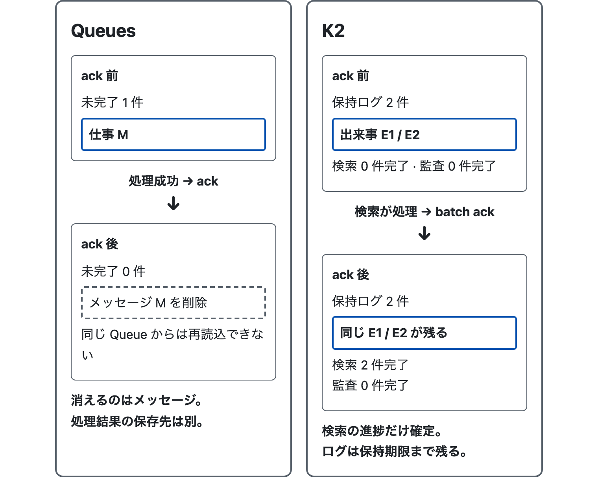
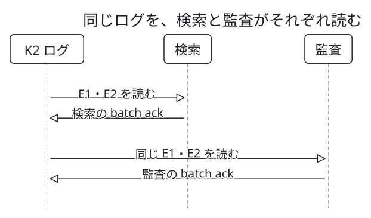

# Queues と K2 は、どちらを使えばよいか？

> 想定読者: mizchi。文書更新から検索・監査を作るサンプルを見たが、Queues と K2 の使い分けがまだ曖昧。図から約 5 分で読む想定。<br>
> 省いたもの: Worker / HTTP / Quint の導入、料金比較。前の発言の「K1」は K2 と解釈した。<br>
> 検証方法: 既存の Quint モデルの ITF、ローカル API の再構築、図の事実・配置・HTML の検査。実 Queues / 実 K2 の疎通は未検証。

## 0. 一枚で選ぶ

選ぶ軸は、**同じ更新履歴を複数の用途で読み、後からも再利用したいか**。Queues は未処理の仕事を運び、K2 は保持された出来事を複数の読者へ渡す。検索の再構築は、現在の DB から行う方法もある。

| 判断すること | Queues | K2 |
| --- | --- | --- |
| ack の後 | メッセージを削除 | 読者の進捗を確定。保持ログは残る |
| 検索と監査へ全件届ける | 用途ごとの Queue へそれぞれ送る構成 | 同じログに別々の subscription |
| 後から検索を作り直す | 元の DB や別保存した履歴から再投入 | 保持期間内なら新 subscription で過去を読む |
| 単に仕事を後回しにする | メール送信、画像変換、Webhook 配送など | 履歴を共有・再読込する必要もある場合に検討 |

ack は「この配送の処理が済んだ」と知らせる操作、subscription は「この用途の読者」とその処理進捗。複数 worker を一 subscription に入れると仕事を分担し、別 subscription を作るとそれぞれが全件を読める。[Queues の仕様](https://developers.cloudflare.com/queues/reference/how-queues-works/)、[K2 の仕様](https://developers.cloudflare.com/k2/features/consume/)

## 1. ack の後、何が消えるか



図1: Queues の一件と K2 の二件は、既存モデルの検査範囲に合わせた件数。違いは数ではなく、処理後にメッセージを残すかどうか。

「画像 M のサムネイルを作る」という仕事なら、成功して ack した後に、その仕事を同じ Queue から読み直す必要はない。消えるのはメッセージであり、宛先へ保存したサムネイルや元画像が消えるわけではない。

「文書が v1、次に v2 へ更新された」という記録は、検索を更新した後も監査に使える。K2 の検索 subscription が ack しても、**ログと監査の進捗は別のまま**。ログは設定した保持期限まで残る。[K2 の保持と読者](https://developers.cloudflare.com/k2/)

図の数値は [`models/queues.qnt`](../../models/queues.qnt) と [`models/k2.qnt`](../../models/k2.qnt) の実行結果から取り出した。`pending` は Queue にまだ処理すべきメッセージがあるか、`cursor` はこのモデルで処理済みとした record 数。実 K2 API の offset を表示したものではない。

<!-- output: semantics -->
```text
Queues: pending 1 -> 0; effectCount=1
K2: retained=2; search cursor=2; audit cursor=0
K2: both subscriptions acked; retained=2
```

## 2. 二つの用途へ、それぞれ全件を渡す



図2: 二件の記録 E1 / E2 を検索が処理し、その後に監査も同じ二件を処理する。再生リンクでは矢印を一つずつ追える。順番を見せるためのモデルで、検索が先に処理する保証ではない。

検索用と監査用の **別 subscription** なら、検索が停止しても監査は進められる。K2 が「E1 は検索、E2 は監査」と割り振る構成ではなく、どちらも E1 / E2 を読む。

一 subscription を複数 worker で読む場合は、同じ仕事の分担になる。worker を増やすことと、用途を増やすことを分けて考える。図の矢印はデータの流れを示すもので、実際の consume は consumer が HTTP で取得する。[K2 consumer の仕様](https://developers.cloudflare.com/k2/features/consume/)

Queues で検索と監査へ全件を届けたいなら、検索用 Queue と監査用 Queue へそれぞれ送る設計が候補になる。この構成案は本資料では未実装。一つの Queue の配送を、用途ごとに全件複製する仕組みとして扱わない。[Queues の consumer](https://developers.cloudflare.com/queues/reference/how-queues-works/#consumers)

## 3. 検索の作り方を、後から変える



図3: このサンプルは検索を空にして新しい subscription 名を保存し、earliest から読み直す。既存 subscription の位置を巻き戻す操作ではない。

検索ロジックを変更したら、保持中の更新イベントを新しい読者で処理し、検索データを再構築できる。監査は既存の読者を使い続けるので、その進捗も計上済みの二件も変えない。

<!-- output: rebuild -->
```text
Rebuild: search v2 -> empty -> v2; replayed=2
Rebuild: audit 2 -> 2 -> 2; subscription changed
```

これはローカル API で実行した結果。**保持期限を過ぎたイベントはこの方法では読めない**。DB に現在の文書が全件あり、過去の履歴が不要なら、その DB を走査して検索を作り直す方法もある。再構築のためだけに K2 が必須になるわけではない。

## 4. 今回のサンプルで選ぶなら

- 検索更新だけを後回しにするなら、Queues を候補にする。完了した仕事を削除でき、現在の DB からの再構築で足りる。
- 検索・監査・将来の分析が同じ更新をそれぞれ読み、過去の保持イベントも使うなら、K2 を候補にする。
- K2 で業務イベントを保存し、その処理から画像変換や通知の仕事を Queues へ送る併用も設計できる。役割を分ける構成案で、このサンプルには未実装。

どちらも再配送が起き得る。今回の outbox とイベント ID による原子的な重複排除は、配送先をどちらにしても必要になる設計上の問題。K2 を選ぶだけで二重計上が消えるわけではない。[Queues の配送保証](https://developers.cloudflare.com/queues/reference/delivery-guarantees/)、[K2 の配送保証](https://developers.cloudflare.com/k2/features/consume/)

ここで判定したのは ack・読者・保持ログの関係と、ローカルでの再構築。実サービスの性能、費用、障害時の最終的な完了は未検証。

## 読み終えたら確認する

1. 検索が ack した後、監査が同じ更新を読めるのはなぜか。
2. 検索と監査の worker を一 subscription に入れるだけで、両方へ全件届けられるか。
3. 最新の文書が DB にあり、検索更新だけを後回しにしたい時、K2 は必須か。
4. K2 の保持期限を過ぎた更新も、新しい subscription で読めるか。

<details>
<summary>答えを見る</summary>

1. 図1・2のように、検索の ack は検索の進捗だけを確定し、保持ログを削除しない。監査は別 subscription を使う。
2. いいえ。同じ subscription の worker は仕事を分担する。用途ごとに全件読むなら別 subscription を作る。
3. 必須ではない。Queues で仕事を運び、必要なら現在の DB から検索を再構築する方法がある。
4. 読めない。図3は保持期間内の記録が残っている場合に限る。

</details>

## 再現

`just dev` を起動したまま、別のターミナルで以下を実行する。`EXPLAINER_SKILL` は mizchi/explainer の explainer スキルのディレクトリ、既定は `~/.agents/skills/explainer`。

```sh
node docs/queues-vs-k2/examples/check-semantics.mjs
node docs/queues-vs-k2/examples/check-rebuild.mjs
just explain-check
```

生成 HTML は `dist/index.html`、再生ページは `dist/fanout.html`。資料の作成・検査には [mizchi/explainer](https://github.com/mizchi/explainer) を使用した。未確認なのは実運用で必要な保持期間と追加する consumer の種類であり、利用時の判断はそこに合わせる。
